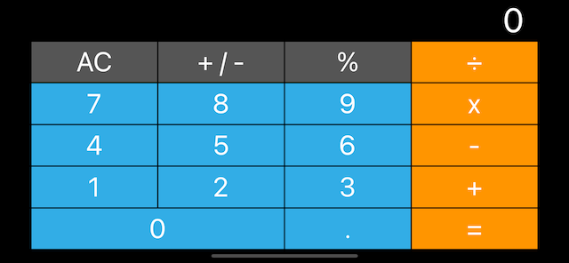

# Calculator-IOS

## Project Description

This project serves as a challenge of our knowledge with Auto-Layout and Constraints. There is no functionality included as of latest commit.

## Technologies Used

1. XCode 13 - IDE
2. Swift 5 - Programming Language
3. UIKit - Interface Builder

## Sample Look

<h3>Portrait</h3>

 

<h3>Landscape</h3>

## Notes

This is a companion project to The App Brewery's Complete App Development Bootcamp, check out the full course at [www.appbrewery.co](https://www.appbrewery.co/)

